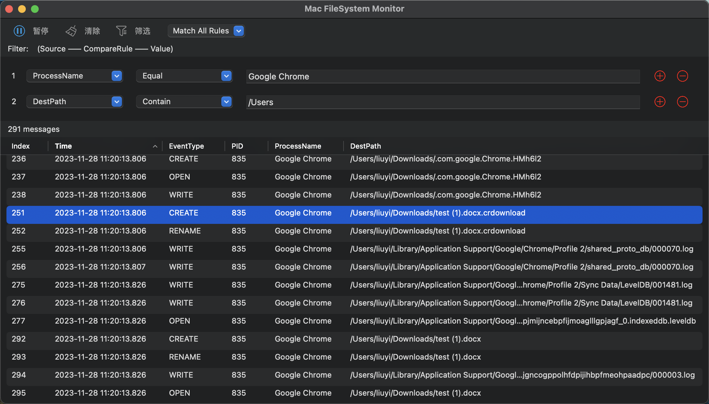

# MacFileSystemMonitor

Mac File System Monitor APP(based on Endpoint Security Framework)

You can use the app to monitor all file operations on MacOS.

And it also provides filters to help you get more accurate information.

**If You want to use, give it Full disk access and run as root.**

